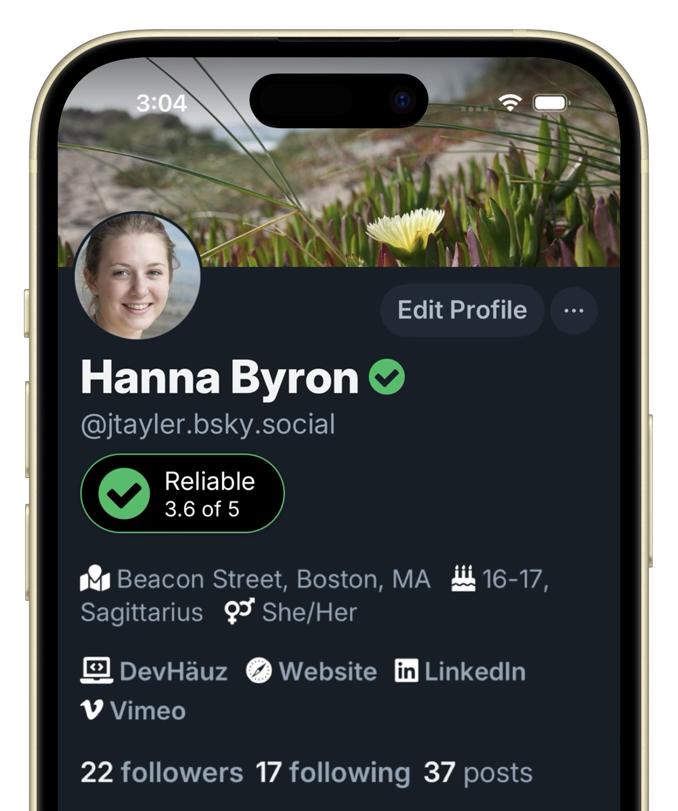
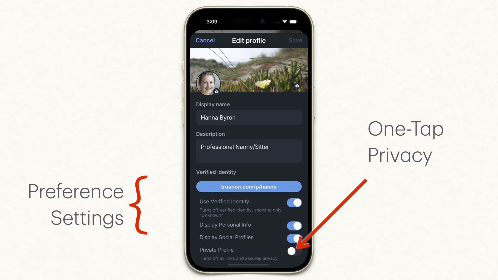
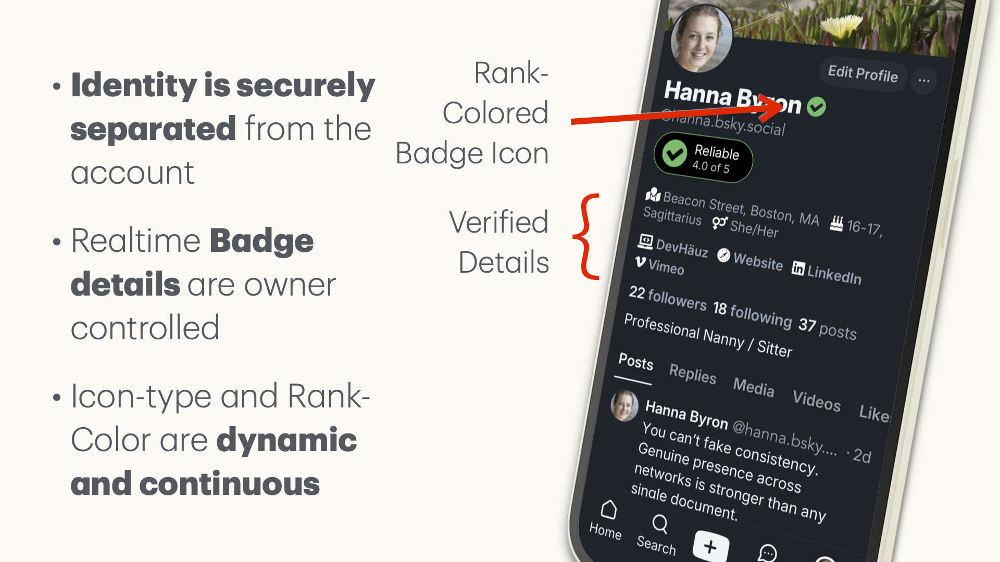
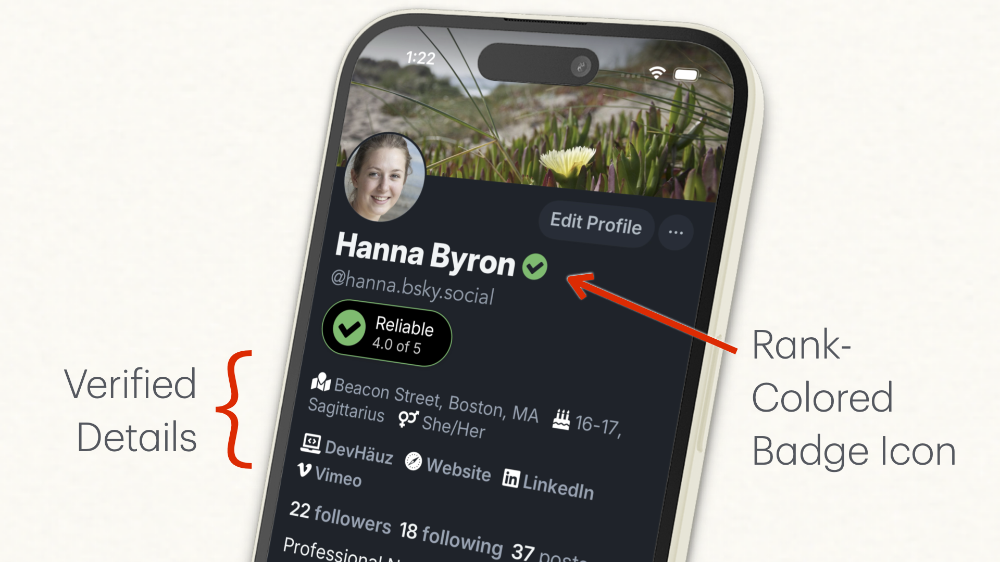

# TruAnon ATProto & BlueSky inherently safe digital identity
**Transitions the responsibility of identity back to its rightful owner—the individual.**  

No authority, no gatekeeping, no risk to privacy. TruAnon integrates seamlessly with ATProto and Bluesky to enable visible, user-backed trust without static IDs or platform control.

This is a portable trust and identity confidence system, purpose-built for decentralized environments like ATProto. It separates identity from accounts, letting anyone prove who they are through visible, dynamic confidence—not static verification or private data.

**Key Points:**
- **No gatekeeping:** Trust is already earned, this existing public transparency needs no force or coercion.
- **Universal:** Equally available to any indivdial regardless of location or language.
- **Privacy by design:** No private data is ever surrendered or stored by platforms.
- **Owner-controlled:** Users decide what to show, when, and to whom —we grant and revoke access at will.
- **Aligned with ATProto:** TruAnon is so perfectly-matched to ATProto’s decentralized model and privacy ethos, you’d think they were designed together.

---

## How it Works

- This does not interfere with authority based or traditional solutions, it offers anyone access to Credibility in a matter of minutes.
- Users link digital properties others know them by (social, professional, etc.).
- Identity is portable and decentralized, leaving data in place without making copies.
- The system verifies ownership, your service displays a dynamic trust rank, and gives identity control back to the individual.
- Platforms can display continuous, validated profile details but never need to ask or store any private information.
  
---

## Integration

- Add TruAnon to any ATProto or Bluesky app with just a few files.
- For implementation details or questions, [contact us](mailto:hello@truanon.com).

---

## Screenshots

Preferences allow owners to display helpful personal or social details

The identity portion of the profile is securely separated from the account so owners retain the right to grant or revoke visibility at will

Validated links and profiles others know you by, is a benefit to anyone —avoiding this transparency is as clear as having it, fraudsters are deterred and move to less trusted platforms

---

## Learn More

- [Read ATProto White Paper](https://truanon.s3.us-east-1.amazonaws.com/whitepapers/Identity+For+The+AT+Protocol.pdf)
- [Node.js Example](https://github.com/jtayler/trusted?tab=readme-ov-file#the-age-restricted-internet)
- [Contact Us](mailto:hello@truanon.com)

---

**This is the answer for decentralized identity**

**When people bring their own proof, services never become bottlenecks or reputational liabilities —responsibility returns to the rightful owner, and fraud becomes obsolete.**

